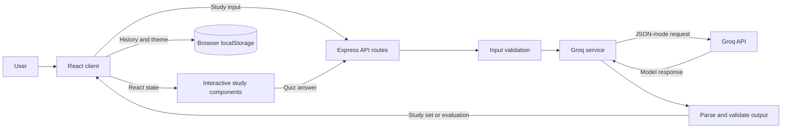

# AI Study Assistant

AI Study Assistant helps learners turn free-form study notes or a topic into a structured, interactive study session. Groq generates study content and evaluates typed quiz answers through a backend API; the resulting data is validated and rendered as React study components, not as a chatbot conversation.


## ✨ Features

- Enter a topic or paste notes, up to 10,000 characters, to generate a study set. The generation prompt requests 5–10 cards with a question, answer, difficulty, and topic.
- Study with flip cards in Learn Mode, or take a Quiz Mode with typed answers.
- Get AI evaluation with a Correct, Almost Correct, or Incorrect verdict, a score, feedback, and the reference answer. If evaluation fails, the answer remains available to retry or edit.
- View a results summary, topic-level weak areas, and partial or incorrect answers with feedback. Practice the individual questions that need work.
- Reopen or retry completed quiz sessions from recent history, or delete entries with confirmation. History and the selected light/dark theme are stored in browser local storage; history is limited to the 50 most recent entries.
- Start “Today’s Review” from weak questions in the most recently completed quiz. This is a latest-session shortcut, not spaced repetition.
- Responsive layout, loading and error states, and form labels and status/error announcements.

## 🧠 How It Works

1. The learner enters a topic or notes. The React client checks that the text is non-empty and no longer than 10,000 characters.
2. The client sends the input to the Express API. The server validates it and calls Groq with the server-side `GROQ_API_KEY`.
3. The Groq prompt requests JSON. The backend parses the model response and validates the expected fields before returning a study set.
4. React stores the returned set in session state and renders it as flip cards or quiz questions.
5. For each quiz answer, the client sends the question, reference answer, and typed answer to the evaluation endpoint. Groq returns a verdict, score, and feedback; the server parses and validates these fields.
6. The client shows evaluation feedback and a results summary. Completed quiz results, cards, and answers are saved in browser local storage for later review.

The browser never receives or uses the Groq API key directly.

## 🏗️ Architecture



The client is a React application served and built with Vite. `client/src/hooks/` manages study-session requests, history, and theme state; `client/src/services/api.js` calls the backend. The Express server mounts study routes under `/api`, validates input and model output, and delegates prompts and SDK requests to the Groq service. History and theme preferences use browser local storage; there is no server-side database. In development, Vite proxies `/api` and `/health` to the backend.

## Getting Started

### Requirements

- Node.js and npm (the repository does not specify a Node.js version)
- A Groq API key

### Clone

No repository URL is declared in the project metadata. Replace the placeholder with the repository URL supplied for your submission:

```bash
git clone <repository-url>
cd <cloned-project-directory>
```

### Install and configure

From the repository root, install both applications’ dependencies:

```bash
npm run install:all
```

Copy `server/.env.example` to `server/.env` (in PowerShell, use `Copy-Item server/.env.example server/.env`; in macOS/Linux shells, use `cp server/.env.example server/.env`) and set `GROQ_API_KEY` in the new file. The example also defines `GROQ_MODEL` and `PORT`; they are optional at runtime, defaulting to `openai/gpt-oss-120b` and `3001` respectively.

### Run locally

Start the backend and frontend in separate terminals from the repository root:

```bash
npm run dev:server
```

```bash
npm run dev:client
```

Open [http://localhost:5173](http://localhost:5173). Vite proxies API and health-check requests to `http://localhost:3001`.

To build the frontend, run `npm run build --prefix client`. The server also provides `npm start --prefix server` for its non-watch start script.

## API

| Method | Endpoint | Request | Success response |
| --- | --- | --- | --- |
| `GET` | `/health` | None | `{ "status": "ok", "model": "..." }` |
| `POST` | `/api/generate-flashcards` | `{ "input": "..." }` | `{ "title": "...", "cards": [{ "id": "...", "question": "...", "answer": "...", "difficulty": "easy", "topic": "..." }] }` |
| `POST` | `/api/evaluate-answer` | `{ "question": "...", "referenceAnswer": "...", "userAnswer": "..." }` | `{ "verdict": "correct", "score": 85, "feedback": "..." }` (`verdict`: `correct`, `partial`, or `incorrect`) |

The API returns `400` for invalid request input, `502` for unreadable or schema-invalid AI responses and other upstream failures, `504` for timed-out Groq requests, and maps Groq authentication and rate-limit errors to `401` and `429`. Both AI operations have a 30-second server-side timeout.

## Configuration

Set these variables in `server/.env`:

| Variable | Required | Default | Description |
| --- | --- | --- | --- |
| `GROQ_API_KEY` | Yes | None | API key used by the server’s Groq SDK client. |
| `GROQ_MODEL` | No | `openai/gpt-oss-120b` | Model identifier sent with Groq requests. |
| `PORT` | No | `3001` | Port used by the Express server. |

Keep the real API key in `server/.env`; do not commit `.env` or put the key in client code. The repository's `.gitignore` excludes `.env`.

## Tech Stack

| Technology | Purpose |
| --- | --- |
| JavaScript and JSX | Client and server application logic |
| React | Component-based frontend and interactive study UI |
| Vite | Frontend development server, API proxy, and build |
| Node.js | Backend runtime |
| Express | HTTP API and route handling |
| Groq SDK / Groq API | Structured study-set generation and answer evaluation |
| Browser local storage | Local quiz history and theme preference |

## Project Structure

```text
study-assistant/
├── README.md
├── package.json             Root install and development scripts
├── client/                  React and Vite application
│   ├── index.html
│   ├── package.json
│   ├── package-lock.json
│   ├── vite.config.js
│   ├── public/               Empty in this repository
│   └── src/
│       ├── App.jsx
│       ├── main.jsx
│       ├── styles.css
│       ├── components/      Home, study modes, quiz, and results UI
│       ├── hooks/           Study session, history, and theme state
│       ├── services/api.js  Requests to the Express API
│       └── utils/           Scoring, validation, and local storage
└── server/                  Express API and Groq integration
    ├── .env.example
    ├── package.json
    ├── package-lock.json
    ├── index.js
    ├── routes/studyRoutes.js
    ├── services/groqService.js
    └── utils/                Request/response validation and error mapping
```

## Quiz and Evaluation

Quiz Mode displays a generated question and accepts a typed answer. The client sends `question`, `referenceAnswer`, and `userAnswer` to `POST /api/evaluate-answer`. The response contains `verdict` (`correct`, `partial`, or `incorrect`), `score` (a number from 0 to 100, rounded by the server), and `feedback`. The interface displays the verdict, score, feedback, and reference answer. Results include a correct/partial/incorrect count and average score; review and weak-area practice include questions with partial or incorrect verdicts.

## Data Persistence

Completed quiz entries are stored under `study-assistant-history` in browser local storage. Entries include the generated cards, answers and evaluations, score/count data, and completion date; the app keeps up to 50 entries. The History list can open a saved result, retry its cards as a new attempt, or delete it. The theme is stored separately under `study-assistant-theme`. This data is browser-local, survives reloads in that browser, and is not backed up or synchronized by a server. Learn Mode progress is not saved as quiz history.

## Error Handling

- Empty or whitespace-only study input and input over 10,000 characters are rejected in the client and server. Empty quiz answers are also rejected.
- The interface shows generation/evaluation loading states and user-facing errors. The client handles network errors, request timeouts, and unreadable server responses.
- Both AI endpoints have a 30-second server-side timeout. Groq authentication errors map to `401`, rate limits to `429`, upstream or invalid AI responses to `502`, and timeouts to `504`. Malformed request JSON is handled as `400`.
- AI output is parsed and checked before use. Flashcards require a non-empty title and cards with non-empty questions/answers and an allowed difficulty; evaluations require an allowed verdict, a numeric score from 0 to 100, and non-empty feedback. Invalid output is rejected with a safe error response.
- If answer evaluation fails, the typed answer remains available and the user can retry the evaluation or edit the answer. Generation errors are shown on Home; there is no dedicated generation retry control.
- If `GROQ_API_KEY` is missing, the server cannot initialize its Groq client. The route returns its generic AI failure response and logs the underlying error server-side.
- Corrupted history JSON is cleared from its local storage key so the app can continue without that history.

## Responsive UI

The layout uses a constrained content width on wider screens and CSS adjustments below 560px, including a single-column mode selector and stacked session/result layouts. It is responsive by implementation; no device-by-device test report is included.

## Accessibility

The forms have programmatic labels, validation errors use alert semantics, loading status is announced, and keyboard focus has a visible `:focus-visible` outline. The repository does not claim WCAG conformance, and no keyboard shortcuts are implemented.

## UI / UX

The Home view combines study input, recent quiz sessions, and a shortcut to review weak questions from the latest completed quiz. A generated set opens into Learn Mode or Quiz Mode. Quiz evaluation feedback is shown inline, followed by results, mistake review, and weak-area actions. The app also includes light/dark themes and a responsive layout; there is no separate feedback page.

## Testing

No automated test files, test framework, or test script are included in the repository. No manual test report is present in the project files.

## Screenshots

No screenshots are present in the repository. Add real screenshots before submission; no image paths are provided here.

- Home
- Learn Mode
- Quiz Mode
- Results
- Feedback (evaluation feedback is inline in Quiz Mode; there is no separate Feedback screen)

## Engineering Decisions

- **Backend for Groq calls:** model requests run through Express so the Groq API key stays server-side.
- **Structured model output:** prompts request JSON, and server-side parsing and validation ensure the UI receives fields it can render rather than free-form chat text.
- **React state and hooks:** components and hooks keep the study flow, evaluation, history, and theme interactive without a separate state-management package.
- **Local storage:** browser storage provides reload-persistent history and theme preference without an account or database; it is intentionally not cloud-synced.

## Limitations

- There is no authentication, account system, or server-side database. Saved history is limited to the current browser.
- AI-generated content and answer evaluations depend on Groq availability and model output; evaluation may be imperfect.
- There is no offline AI generation or spaced-repetition scheduler.
- Learn Mode progress is not persisted; only completed quiz results are saved.
- No automated test suite or test script is included in the repository.
- The model is prompted to generate 5–10 cards, but the server validates that the cards array is non-empty rather than enforcing that count.
- “Today’s Review” uses only the most recent completed quiz; it does not schedule reviews or combine weak questions across sessions.
- No repository license is specified.

## Future Improvements

Possible future work, not currently implemented, includes automated tests, account-based cloud history, spaced repetition, additional question formats, progress analytics, and support for additional model providers.

## Internship Assignment Context

The project demonstrates a React interface connected to a separate backend, an LLM API integration, structured AI data, interactive study and quiz flows, request/error handling, and responsive styling.

## Learning Outcomes

The implementation provides experience with integrating an LLM into a web application, parsing and validating structured model responses, managing asynchronous React state, building an answer-evaluation workflow, handling external-service failures, and separating frontend and backend responsibilities.

## Author

**Om Prakash Karri**  
GitHub: [OMPRAKASHKARRI](https://github.com/OMPRAKASHKARRI)

## License

No license has been specified for this repository.

## ⏱️ Time Spent

> Approximately [X hours], including development, debugging, testing, and documentation.
